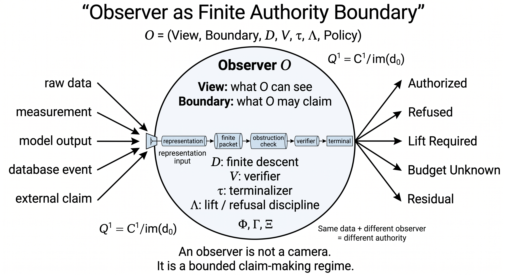

# Observer-Relative Ontology & Data locality

A primary thesis of the Simplex project is that data consistency cannot be evaluated independently of the observer's frame of reference when dealing with distributed networks, caching layers, or replication streams.

---

## Subject Ontology: Relvar vs. Boundary Relvar

In classical database systems, a relation variable (`relvar`) represents a set of facts assumed to be globally visible. The Simplex framework distinguishes between:
* **Relvar**: Local database relations with static schemas.
* **Boundary Relvar**: Relations that interface with exterior channels, streams, or replica nodes.
* **Observer**: An entity (such as a cache layer, client, or replica node) that reads from or writes to these boundary relvars.

---

## Epistemic Freshness & Spacetime Invariants

In distributed setups, absolute clock synchronization across nodes is not assumed. Instead, the model incorporates constraints derived from physical analogies:
1. **Lightcone Causality**: Events must follow a causal ordering constraint where no observer can read a state change before the write event has propagated through its network horizon.
2. **Clock Sync Bounds**: Transactions and writes are tagged with interval-valued timestamps to handle clock drift and network lag.
3. **Locality Bounds**: States are only consistent within a defined local neighborhood (locality cone).

*Figure 3: The interaction map between relational subjects, boundaries, and observer frameworks.*

By modeling databases with explicit observer contexts:
* Materialized views are updated relative to the observer's access window.
* Invalidation is scheduled based on the observer's distance (network latency/lag) from the source.
* Out-of-order write streams are processed using cochain operators to evaluate if the received stream events can commute.
