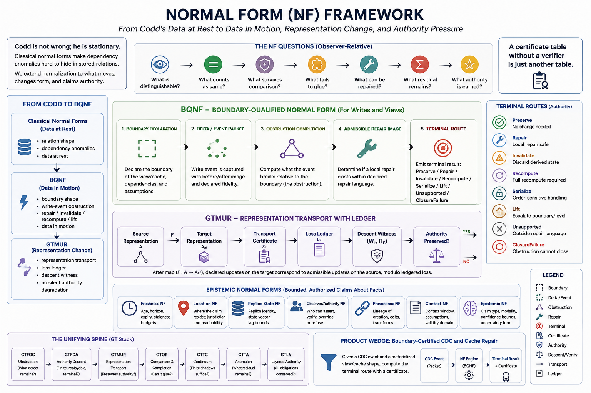
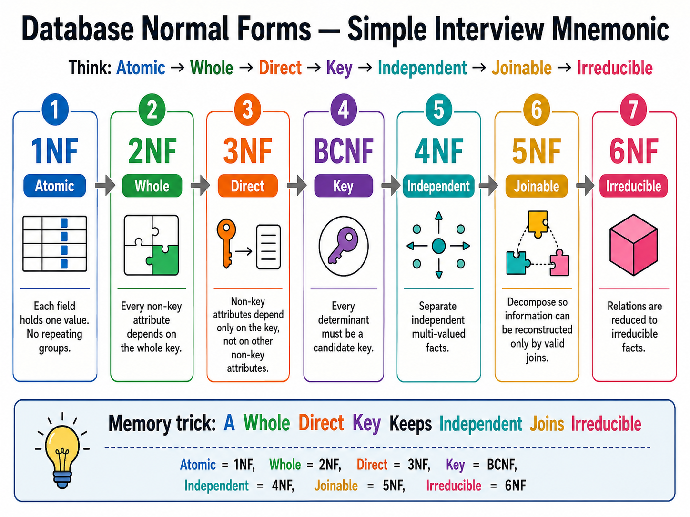

# Theory & Cochain Substrate

The Simplex project models database state changes as a cochain complex to evaluate whether write events can be resolved locally without introducing inconsistencies.

---

## The Cochain Model of Data in Motion

In this framework, database layers and validation checks are structured as cochain complexes:

$$C^0 \xrightarrow{d_0} C^1 \xrightarrow{d_1} C^2$$

Where:
* **$C^0$ (0-cochains)**: Represents the space of admissible local corrections or repairs.
* **$C^1$ (1-cochains)**: Represents the space of write defects or anomalies.
* **$d_0$ (Boundary Operator)**: Maps a local correction to its induced change on the defect space.
* **$Q^1$ (Quotient Obstruction Space)**: Defined as $Q^1 = C^1 / \operatorname{im}(d_0)$.

### Defect Classification & Resolution
When a write event $e$ occurs, it induces a defect $\omega(e) \in C^1$.
1. **Exact Defect ($[\omega] = 0$)**: The defect class evaluates to zero in $Q^1$, meaning $\omega(e) = d_0 \alpha$ for some correction $\alpha$. The change is locally repairable (e.g., incremental materialized view update).
2. **Closed Defect ($d_1 \omega = 0, [\omega] \neq 0$)**: The defect is closed but not exact. The change is not locally repairable and requires fallback routes like serialization or recomputation.
3. **Open Defect ($d_1 \omega \neq 0$)**: Represents a boundary violation that is refused.

*Figure 1: The structural map of Simplex normal form layers and their associated cochain transitions.*

---

## Labeled Obstruction & Classic Normal Forms

The project demonstrates that classical normal forms (1NF, 2NF, 3NF, BCNF, etc.) can be mapped to specific slices of this quotient obstruction space. By defining dependency-specific matrices, static normal form violations are shown to correspond to non-zero obstruction classes.

*Figure 2: The hierarchy of database normal forms from basic representations up to boundary-certified states.*

Under this taxonomy, database correctness is evaluated as a property of the triple:
$$\text{Correctness} = (\text{Schema}, \text{Workload}, \text{Write Stream})$$

This model supports deciding cache invalidation requirements dynamically, suggesting that invalidation is only required when the induced defect class $[\omega]$ is non-zero.
